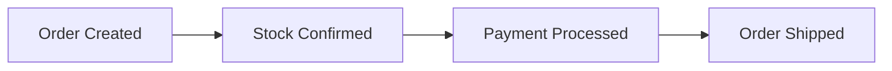
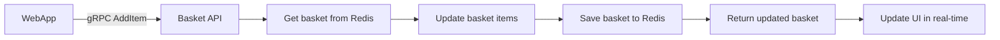
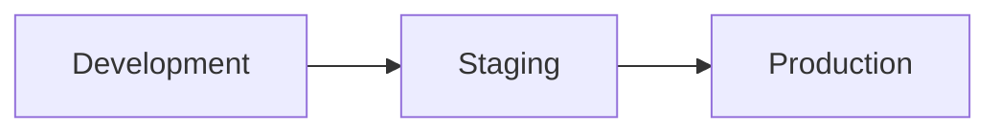

# Product Owner Guide: eShop Reference Application

## Executive Summary

**eShop** is a reference .NET e-commerce application demonstrating modern cloud-native architecture using microservices patterns and .NET Aspire orchestration. Built on .NET 9/10, it showcases enterprise-grade practices for building scalable, distributed e-commerce systems.

**Business Value**: This solution serves as a blueprint for building production-ready e-commerce platforms with modern architecture, enabling teams to understand and implement best practices for:
- Microservices-based e-commerce systems
- Cloud-native application development
- Event-driven architecture
- Domain-driven design (DDD)
- AI-powered catalog search capabilities

---

## What the Solution Does

### Core Business Capabilities

#### 1. **Online Shopping Experience**
- **Product Catalog Browsing**: Users can browse products with filtering by brand, type, and search
- **AI-Powered Search**: Semantic search for finding relevant products using natural language
- **Shopping Cart Management**: Add, remove, and modify items in cart with real-time updates
- **Order Placement**: Complete checkout process with payment and shipping information
- **Order Tracking**: View order history and current order status

#### 2. **Product Management**
- Catalog of products with images, descriptions, and pricing
- Product organization by brand and type
- Dynamic pricing updates
- Inventory tracking
- Product image management

#### 3. **Order Processing**
- Order creation and validation
- Payment processing simulation
- Stock confirmation
- Order status tracking through lifecycle
- Order fulfillment and shipping

#### 4. **Identity & Security**
- User registration and authentication
- OAuth 2.0 / OpenID Connect via IdentityServer
- Secure API access with token-based authentication
- Role-based access control

#### 5. **Webhook Notifications**
- Event subscription management
- Real-time notifications for order status changes
- Product price change notifications
- Extensible event system for integrations

---

## How It Works: Architecture Overview

### High-Level Architecture

The solution implements a **microservices architecture** orchestrated by **.NET Aspire**, consisting of:

```mermaid
flowchart TD
    A[.NET Aspire AppHost\n(Orchestration & Service Discovery)]

    A --> W[WebApp (Blazor)]
    A --> APIs[APIs]
    A --> P[Processors (Workers)]

    APIs --> I[Identity API]
    APIs --> C[Catalog API]
    APIs --> O[Ordering API]
    P --> Pay[Payment Processor]

    I --> DB[(PostgreSQL)]
    C --> DB
    O --> DB
    P --> MQ[(RabbitMQ Event Bus)]
    O --> MQ
```

### Key Components

#### **Frontend Applications**

1. **WebApp** (Blazor Server)
   - Main customer-facing e-commerce website
   - Interactive server-side rendering
   - Pages: Catalog, Product Details, Cart, Checkout, Order History
   - Real-time updates via SignalR
   - Responsive design

2. **HybridApp** (.NET MAUI)
   - Cross-platform mobile/desktop application
   - Native performance with web view integration
   - Shared business logic with WebApp
   - Offline capability support

3. **WebhookClient**
   - Administrative dashboard
   - Webhook subscription management
   - Event monitoring and testing

#### **Backend APIs**

1. **Catalog API**
   - Product catalog management
   - RESTful endpoints for CRUD operations
   - Image storage and serving
   - AI-powered semantic search (via pgvector)
   - API versioning (v1 and v2)
   - Integration with OpenAI/Ollama for product recommendations

2. **Basket API**
   - Shopping cart management
   - gRPC service for high-performance operations
   - Redis-backed for fast access
   - User-specific basket isolation

3. **Ordering API**
   - Order placement and management
   - CQRS pattern implementation (MediatR)
   - Order lifecycle management
   - Payment coordination
   - Domain-Driven Design (DDD) patterns

4. **Identity API**
   - Authentication and authorization
   - Based on IdentityServer (Duende)
   - OAuth 2.0 / OpenID Connect provider
   - User management
   - Client application registration

5. **Webhooks API**
   - Event subscription management
   - Webhook delivery system
   - Event filtering and routing
   - Retry logic for failed deliveries

#### **Background Workers**

1. **OrderProcessor**
   - Listens to order-related events
   - Processes order state transitions
   - Handles business logic validation
   - Event-driven processing

2. **PaymentProcessor**
   - Simulates payment gateway integration
   - Processes payment confirmation events
   - Publishes payment status events
   - Handles payment failures and retries

#### **Infrastructure Components**

1. **PostgreSQL Database**
   - Primary data store for all microservices
   - Separate databases per service (CatalogDB, IdentityDB, OrderingDB, WebhooksDB)
   - pgvector extension for AI/ML vector search
   - Entity Framework Core migrations

2. **RabbitMQ (Event Bus)**
   - Asynchronous messaging backbone
   - Pub/sub pattern for inter-service communication
   - Reliable message delivery
   - Event-driven architecture enabler

3. **Redis Cache**
   - High-performance caching layer
   - Session management
   - Shopping basket storage
   - Distributed cache for shared data

4. **YARP (Reverse Proxy)**
   - Mobile BFF (Backend for Frontend)
   - API gateway functionality
   - Request routing and aggregation
   - Service discovery integration

---

## Technology Stack

### Core Frameworks
- **.NET 9/10**: Latest .NET runtime and libraries
- **.NET Aspire 13.0+**: Cloud-native orchestration and service defaults
- **ASP.NET Core**: Web framework for APIs and web apps
- **Blazor Server**: Interactive web UI framework
- **.NET MAUI**: Cross-platform mobile/desktop framework

### Data & Messaging
- **Entity Framework Core**: ORM for database access
- **PostgreSQL**: Relational database with pgvector extension
- **Redis**: In-memory cache and data structure store
- **RabbitMQ**: Message broker for event-driven architecture

### API & Communication
- **gRPC**: High-performance RPC framework (Basket API)
- **REST APIs**: HTTP/JSON endpoints
- **YARP**: Reverse proxy and API gateway
- **MediatR**: In-process messaging for CQRS

### Security & Identity
- **IdentityServer (Duende)**: OAuth 2.0 / OpenID Connect
- **ASP.NET Core Identity**: User management
- **JWT Tokens**: API authentication

### AI/ML Capabilities
- **Azure OpenAI**: Optional AI-powered features
- **Ollama**: Local LLM integration option
- **pgvector**: Vector similarity search for semantic product search

### Development & Testing
- **Playwright**: End-to-end testing
- **xUnit**: Unit testing framework
- **Aspire Dashboard**: Development-time observability
- **OpenAPI/Swagger**: API documentation

---

## Key Architectural Patterns

### 1. **Microservices Architecture**
Each business capability is isolated into independent, deployable services with:
- Own database (Database per Service pattern)
- Independent scaling
- Technology flexibility
- Fault isolation

### 2. **Event-Driven Architecture**
Services communicate asynchronously via RabbitMQ:
- **Integration Events**: Cross-service communication
- **Domain Events**: Within-service notifications
- **Eventual Consistency**: Distributed transaction management
- **Publish-Subscribe**: Decoupled service interactions

**Example Event Flow:**


### 3. **Domain-Driven Design (DDD)**
Ordering domain implements tactical DDD patterns:
- **Aggregates**: Order, Buyer (consistency boundaries)
- **Entities**: Order, OrderItem
- **Value Objects**: Address, CardType
- **Domain Events**: OrderStartedDomainEvent
- **Repository Pattern**: Data access abstraction

### 4. **CQRS (Command Query Responsibility Segregation)**
Ordering API separates:
- **Commands**: Write operations (CreateOrder, CancelOrder)
- **Queries**: Read operations (GetOrder, GetOrdersByUser)
- **MediatR**: Mediates between API and handlers

### 5. **API Gateway / BFF Pattern**
YARP-based mobile-bff provides:
- Single entry point for mobile clients
- Request aggregation
- Protocol translation
- Service discovery

### 6. **Service Defaults**
Shared cross-cutting concerns via `eShop.ServiceDefaults`:
- Health checks
- OpenTelemetry (observability)
- Service discovery
- Resilience patterns
- Logging and diagnostics

---

## User Journeys

### Journey 1: Browse and Purchase Product

1. **User visits WebApp** → Lands on catalog page
2. **Browse products** → Filter by brand/type or search
3. **View product details** → Click on product for more info
4. **Add to cart** → Item added to Redis-backed basket
5. **Proceed to checkout** → Review items and quantities
6. **Login/Register** → Redirected to Identity API if not authenticated
7. **Enter shipping/payment** → Submit order details
8. **Place order** → Order created in Ordering API
9. **Order processing**:
   - OrderProcessor validates stock
   - PaymentProcessor confirms payment
   - Order status updated via events
10. **Confirmation** → User sees order confirmation and tracking

### Journey 2: AI-Powered Product Search

1. **User enters natural language search** → "Show me camping gear for winter"
2. **Catalog API processes query**:
   - Generates embedding via OpenAI/Ollama
   - Performs vector similarity search in PostgreSQL
   - Returns semantically relevant products
3. **Results displayed** → Products ranked by relevance

### Journey 3: Webhook Integration (B2B)

1. **Partner registers webhook** → Via WebhookClient UI
2. **Subscribe to events** → Choose event types (OrderShipped, PriceChanged)
3. **Order ships** → Event published to RabbitMQ
4. **Webhooks API receives event** → Matches subscriptions
5. **Webhook delivered** → HTTP POST to partner endpoint
6. **Partner processes** → Updates their system with order status

---

## Data Flow Examples

### Order Creation Flow

```mermaid
flowchart LR
    U[WebApp (User)] --> OA[Ordering API]
    OA -->|POST /api/orders| OA
    OA --> V[Validate request]
    V --> AGG[Create Order aggregate (DDD)]
    AGG --> DB[Save to OrderingDB]
    DB --> E1[Publish OrderStartedIntegrationEvent]
    E1 --> OP[OrderProcessor]
    OP --> SC[Validate stock]
    SC --> E2[Publish OrderStockConfirmedIntegrationEvent]
    E2 --> PP[PaymentProcessor]
    PP --> PAY[Process payment]
    PAY --> E3[Publish OrderPaymentSucceededIntegrationEvent]
    E3 --> OA2[Ordering API]
    OA2 --> S[Update status to "Paid"]
    S --> E4[Publish OrderStatusChangedToPaidIntegrationEvent]
    E4 --> WH[Webhooks API]
    WH --> D[Deliver webhooks to subscribers]
```

### Basket Update Flow



---

## Success Metrics & KPIs

### User Experience Metrics
- **Page Load Time**: < 2 seconds for catalog page
- **Cart Operations**: < 500ms for add/remove items
- **Order Completion Time**: < 5 seconds from submit to confirmation
- **Search Relevance**: AI search accuracy vs traditional search

### System Performance
- **API Response Time**: 95th percentile < 500ms
- **Order Processing Time**: End-to-end < 10 seconds
- **Event Delivery**: 99.9% success rate
- **Service Availability**: 99.9% uptime per service

### Business Metrics
- **Conversion Rate**: Percentage of carts converted to orders
- **Average Order Value**: Revenue per order
- **Webhook Reliability**: Delivery success rate for integrations
- **Search Effectiveness**: Click-through rate on search results

---

## Deployment & Environments

### Development
- **Local Development**: Docker Desktop + .NET Aspire
- **Hot Reload**: Fast inner-loop development
- **Aspire Dashboard**: http://localhost:19888 (service monitoring)
- **PostgreSQL, Redis, RabbitMQ**: Containerized locally

### Environments Pattern


### Cloud Deployment Options
- **Azure**: 
  - Azure Container Apps (recommended for Aspire)
  - Azure Kubernetes Service (AKS)
  - Azure PostgreSQL Flexible Server
  - Azure Cache for Redis
  - Azure Service Bus (alternative to RabbitMQ)
  
- **On-Premises**:
  - Kubernetes cluster
  - Self-hosted PostgreSQL
  - Self-hosted RabbitMQ
  - Load balancer for ingress

### Configuration Management
- **appsettings.json**: Per-environment configuration
- **User Secrets**: Development credentials
- **Azure Key Vault**: Production secrets (when using Azure)
- **Environment Variables**: Container-based configuration

---

## Feature Flags & Rollout Strategy

### Current Feature Flags

1. **OpenAI Integration** (`useOpenAI` in AppHost)
   - **Purpose**: Enable AI-powered product recommendations and semantic search
   - **Default**: `false`
   - **Configuration**: Set to `true` and configure connection string in appsettings

2. **Ollama Integration** (`useOllama` in AppHost)
   - **Purpose**: Local LLM alternative to OpenAI
   - **Default**: `false`
   - **Configuration**: Set to `true` for local AI inference

### Recommended Rollout Strategy

#### Phase 1: Core E-commerce (Baseline)
- Catalog browsing and search
- Shopping cart
- Order placement
- User authentication
- **Risk**: Low - proven patterns
- **Users**: All

#### Phase 2: Event-Driven Processing (Progressive)
- Background order processing
- Payment simulation
- Webhook delivery
- **Risk**: Medium - depends on infrastructure
- **Users**: Gradual rollout (10% → 50% → 100%)

#### Phase 3: AI Features (Experimental)
- Semantic product search
- AI recommendations
- **Risk**: Medium-High - external dependency
- **Users**: Opt-in or A/B testing
- **Rollback**: Disable feature flags

### Canary Deployment
For critical services (Ordering API, Payment Processor):
1. Deploy to 5% of instances
2. Monitor error rates and latency
3. Expand to 25% → 50% → 100%
4. Automated rollback if metrics degrade

---

## Dependencies & Integrations

### Required External Services
- **PostgreSQL**: Database server (v14+)
- **RabbitMQ**: Message broker (v3.11+)
- **Redis**: Cache server (v7+)

### Optional External Services
- **Azure OpenAI**: AI-powered features
- **Ollama**: Local LLM inference
- **SMTP Server**: Email notifications (not currently implemented)
- **Payment Gateway**: Replace PaymentProcessor with real integration

### Internal Dependencies
```
WebApp → Basket API, Catalog API, Ordering API, Identity API
Basket API → Identity API (authentication)
Ordering API → Identity API (authentication)
OrderProcessor → Ordering.Infrastructure (shared domain)
All Services → RabbitMQ (event bus)
All Services → eShop.ServiceDefaults (cross-cutting concerns)
```

---

## Acceptance Criteria

### Functional Requirements
✅ **FR1**: User can browse catalog with pagination and filtering  
✅ **FR2**: User can add/remove items to/from cart  
✅ **FR3**: User can register and authenticate  
✅ **FR4**: User can place order with shipping/payment details  
✅ **FR5**: User can view order history and details  
✅ **FR6**: Order processes through lifecycle (Submitted → Paid → Shipped)  
✅ **FR7**: Webhooks deliver events to subscribers  
✅ **FR8**: AI search returns semantically relevant products (when enabled)  

### Non-Functional Requirements
✅ **NFR1**: APIs respond within 500ms (p95)  
✅ **NFR2**: System handles concurrent users (horizontal scaling)  
✅ **NFR3**: Services are independently deployable  
✅ **NFR4**: Failed events are retried automatically  
✅ **NFR5**: Health checks expose service status  
✅ **NFR6**: Logs and metrics available via OpenTelemetry  
✅ **NFR7**: HTTPS enforced in production  

### Quality Gates
- **Unit Test Coverage**: > 80% for domain logic
- **Functional Tests**: All critical paths covered
- **E2E Tests**: Playwright tests for user journeys
- **Security Scans**: No critical vulnerabilities
- **Performance Tests**: Load testing passes (1000 concurrent users)

---

## Compliance & Security Considerations

### Data Privacy
- **PII Handling**: User data (email, address, payment) encrypted at rest
- **GDPR Compliance**: User consent, right to be forgotten (implement data deletion)
- **PCI DSS**: Payment data not stored (use tokenization in production)

### Security Best Practices
- ✅ HTTPS/TLS for all external endpoints
- ✅ JWT-based authentication
- ✅ API authorization with scopes
- ✅ SQL injection prevention (parameterized queries via EF Core)
- ✅ XSS protection (Blazor's built-in encoding)
- ⚠️ Rate limiting (should implement for production)
- ⚠️ CORS policies (configure restrictively)

### FedRAMP Considerations (if applicable)
If deploying to FedRAMP environment:
- **Audit Logging**: Enable detailed logging for all data access
- **Encryption**: AES-256 for data at rest, TLS 1.2+ for transit
- **Access Control**: Implement RBAC with least privilege
- **Vulnerability Scanning**: Automated scans in CI/CD
- **Configuration Management**: Immutable infrastructure (containers)
- **Incident Response**: Implement alerting and response procedures

---

## Risks & Mitigation

### Technical Risks

| Risk | Impact | Likelihood | Mitigation |
|------|--------|------------|------------|
| RabbitMQ outage | Orders not processed | Medium | Implement message persistence, circuit breakers, fallback to direct calls |
| Redis failure | Cart data loss | Medium | Implement Redis clustering, periodic persistence, graceful degradation |
| Database connection pool exhaustion | API failures | High | Connection pooling tuning, read replicas, query optimization |
| External AI service downtime | Search degraded | Low | Fallback to traditional search, caching, timeout configuration |
| Event message poisoning | Queue blocking | Low | Dead letter queues, retry limits, message validation |

### Operational Risks

| Risk | Impact | Likelihood | Mitigation |
|------|--------|------------|------------|
| Deployment failure | Downtime | Medium | Blue-green deployment, automated rollback, health checks |
| Configuration drift | Inconsistent behavior | Medium | Infrastructure as Code, configuration management |
| Dependency updates breaking changes | Build failures | High | Dependabot alerts, automated testing, version pinning |
| Insufficient monitoring | Undetected issues | High | OpenTelemetry implementation, alerting thresholds, dashboards |

---

## Getting Started

### For Product Owners
1. **Review Architecture Diagram**: Understand service interactions
2. **Run Locally**: Experience the application firsthand
3. **Review User Journeys**: Walk through key scenarios
4. **Understand Event Flow**: See how orders process asynchronously
5. **Explore Aspire Dashboard**: View real-time service health

### For Development Teams
1. **Prerequisites**: Docker Desktop, .NET 9 SDK, Visual Studio 2022 or VS Code
2. **Clone Repository**: `git clone https://github.com/dotnet/eshop`
3. **Run Solution**: `dotnet run --project src/eShop.AppHost`
4. **Access Dashboard**: Navigate to displayed Aspire dashboard URL
5. **Access WebApp**: Click on WebApp endpoint in dashboard

### Quick Start Commands
```powershell
# Clone and navigate
git clone https://github.com/dotnet/eshop
cd eshop

# Ensure Docker is running
docker info

# Run the application
dotnet run --project src/eShop.AppHost/eShop.AppHost.csproj

# Access the dashboard URL shown in console output
# Example: http://localhost:19888/login?t=<token>
```

---

## Future Roadmap Considerations

### Near-Term Enhancements
- **Real Payment Gateway Integration**: Replace simulator with Stripe/PayPal
- **Email Notifications**: Order confirmation, shipping updates
- **Product Reviews & Ratings**: Customer feedback system
- **Inventory Management**: Low stock alerts, restock notifications
- **Admin Dashboard**: Product management, order management

### Medium-Term Features
- **Recommendation Engine**: "Customers also bought" feature
- **Promotions & Discounts**: Coupon codes, sale pricing
- **Advanced Search**: Faceted search, filters
- **Multi-Currency Support**: International customers
- **Multi-Tenant**: Support for multiple stores

### Long-Term Vision
- **Real-Time Inventory**: Integration with warehouse systems
- **Fulfillment Orchestration**: 3PL integration
- **Analytics & BI**: Customer insights, sales reporting
- **Mobile Apps**: Native iOS/Android apps (beyond MAUI)
- **Voice Commerce**: Integration with Alexa/Google Assistant

---

## Support & Resources

### Documentation
- **Main README**: [README.md](../README.md)
- **Architecture Docs**: [docs/](../docs/)
- **API Documentation**: Swagger UI available at `/swagger` endpoints
- **.NET Aspire Documentation**: https://learn.microsoft.com/dotnet/aspire/

### Community & Support
- **GitHub Issues**: Report bugs and feature requests
- **Discussions**: Architecture questions and best practices
- **.NET Community**: https://dotnet.microsoft.com/platform/community

### Related Resources
- **eShop on Containers**: Previous version with Kubernetes focus
- **Microsoft Learn**: .NET Aspire tutorials
- **Enterprise Patterns**: Domain-Driven Design, CQRS, Event Sourcing

---

## Glossary

- **Aggregate**: DDD pattern for consistency boundaries (e.g., Order)
- **Aspire**: .NET framework for cloud-native app orchestration
- **BFF**: Backend for Frontend - API gateway pattern
- **CQRS**: Command Query Responsibility Segregation
- **DDD**: Domain-Driven Design
- **Integration Event**: Asynchronous message between services
- **MediatR**: In-process messaging library
- **Microservices**: Architectural style with independent, deployable services
- **pgvector**: PostgreSQL extension for vector similarity search
- **YARP**: Yet Another Reverse Proxy - .NET-based proxy

---

## Document Version

**Version**: 1.0  
**Date**: December 8, 2025  
**Author**: Product Owner Onboarding  
**Solution Version**: .NET 9/10, Aspire 13.0+  

---

## Feedback & Questions

For questions about this document or the solution, contact:
- **Technical Lead**: [Architecture questions]
- **Product Owner**: [Business requirements]
- **Development Team**: [Implementation details]

This document is a living guide and should be updated as the solution evolves.
